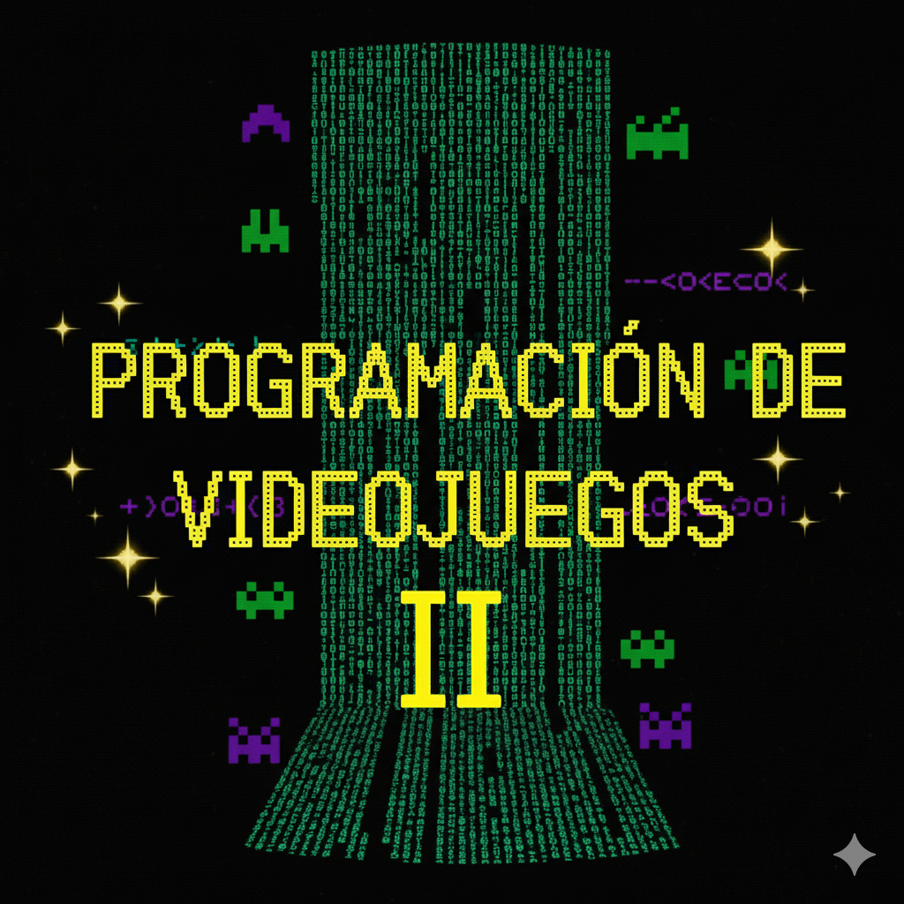

# 25_TDPV_ProgVJ_II - Programación de Videojuegos II



---

## 🚀 Descripción

Este repositorio contiene el proyecto del primer trabajo práctico de **Programación de Videojuegos II** para la **Tecnicatura en Diseño y Programación de Videojuegos** (FICH — UNL).  

---

## 📦 Instalación

1. Clonar este repositorio  
   ```
   git clone https://github.com/ArmandIsCoding/25_TDPV_ProgVJ_II.git
   ```

2. Abrir Unity Hub e importar el proyecto  
   - Unity la última versión LTS disponible
   - Tenés que tener instalados los módulos de **2D Core** y **Lua Editor**.

3. Ejecutar la escena principal  
   - `Assets/Scenes/Main.unity`  
   - Presionar **Play** y experimentar
---


## 🛠️ Stack

- Unity 6.2 6000.2.0f1 LTS  
- C#

---

## 🤝 Misión

- Crear un videojuego 2D con Unity Engine y el lenguaje de programación C#
